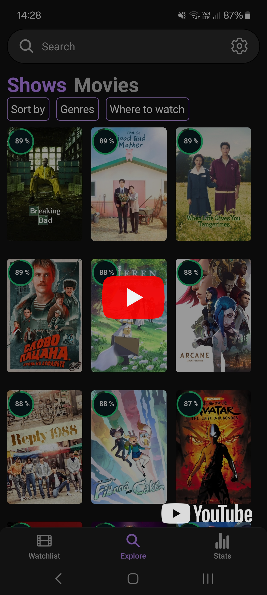

<a id="readme-top"></a>

<!-- PROJECT LOGO -->
<br />
<div align="center">
  <a href="https://github.com/rivenintech/WatchVault">
    
  </a>

<h3 align="center">WatchVault</h3>

  <p align="center">
    A minimalistic app to track movies and TV shows, discover new favorites, and manage your watchlist effortlessly.
    <br />
    <br />
    <a href="#app-video-demo">View Demo</a>
    <!-- &middot;
    <a href="https://github.com/rivenintech/WatchVault/issues/new?labels=bug&template=bug-report---.md">Report Bug</a>
    &middot;
    <a href="https://github.com/rivenintech/WatchVault/issues/new?labels=enhancement&template=feature-request---.md">Request Feature</a> -->
  </p>
</div>

<!-- TABLE OF CONTENTS -->
<details>
  <summary>Table of Contents</summary>
  <ol>
    <li>
      <a href="#about-the-app">About The App</a>
      <ul>
        <li><a href="#app-video-demo">App Video Demo</a></li>
        <li><a href="#screenshots">Screenshots</a></li>
        <li><a href="#built-with">Built With</a></li>
      </ul>
    </li>
    <li><a href="#️-early-development-notice">⚠️ Early Development Notice</a></li>
    <!-- <li>
      <a href="#building-from-source">Building From Source</a>
      <ul>
        <li><a href="#prerequisites">Prerequisites</a></li>
        <li><a href="#installation">Installation</a></li>
      </ul>
    </li> -->
    <li><a href="#contact">Contact</a></li>
    <li><a href="#credits">Credits</a></li>
  </ol>
</details>

<!-- ABOUT THE PROJECT -->

## About The Project

### App Video Demo

<div align="center">
    <a href="https://youtube.com/shorts/EUhSE3lzuA8" target="_blank">
        
    </a>
</div>

### Screenshots

| Watchlist Tab           | Explore Tab         | Movie's Page                  | TV Show's Page              | Stats Tab       |
| ----------------------- | ------------------- | ----------------------------- | --------------------------- | --------------- |
| ![Watchlist][Watchlist] | ![Explore][Explore] | ![MovieDetails][MovieDetails] | ![ShowDetails][ShowDetails] | ![Stats][Stats] |

<p align="right">(<a href="#readme-top">back to top</a>)</p>

### Built With

- [![Expo][Expo]][Expo-url]
- [![React Native][ReactNative]][ReactNative-url]
- [![TypeScript][TypeScript]][TypeScript-url]
- [![React Query][react-query]][react-query-url]
- [![DrizzleORM][DrizzleORM]][DrizzleORM-url]
- [![Jest][Jest]][Jest-url]
- [![TMDB][TMDB]][TMDB-url]

<p align="right">(<a href="#readme-top">back to top</a>)</p>

## ⚠️ Early Development Notice

This app is currently in the very early stages of development (pre-release). Expect bugs, missing features, and frequent changes — I'm actively working to improve things.

There is no app store release yet, but one might be considered in the future.

Please note that it's not recommended to use it as your primary or only movie/tv shows tracker, as the database schema may change, potentially leading to data loss or incompatibility. The app also uses [Drizzle ORM][DrizzleRoadmap-url], which is expected to release v1.0 soon, bringing significant changes to how the app interacts with the database.

Contributions are not being accepted at the moment, but if you find any bugs or issues, feel free to report them via the "Issues" tab — your feedback is appreciated!

<p align="right">(<a href="#readme-top">back to top</a>)</p>

<!-- BUILDING FROM SOURCE -->
<!-- ## Building From Source

This is an example of how you may give instructions on setting up your project locally.
To get a local copy up and running follow these simple example steps.

### Prerequisites

This is an example of how to list things you need to use the software and how to install them.

* npm

  ```sh
  npm install npm@latest -g
  ```

### Installation

1. Get a free API Key at [https://example.com](https://example.com)
2. Clone the repo

   ```sh
   git clone https://github.com/rivenintech/WatchVault.git
   ```

3. Install NPM packages

   ```sh
   npm install
   ```

4. Enter your API in `config.js`

   ```js
   const API_KEY = 'ENTER YOUR API';
   ```

5. Change git remote url to avoid accidental pushes to base project

   ```sh
   git remote set-url origin rivenintech/WatchVault
   git remote -v # confirm the changes
   ```

<p align="right">(<a href="#readme-top">back to top</a>)</p> -->

<!-- USAGE EXAMPLES -->
<!-- ## Usage

Use this space to show useful examples of how a project can be used. Additional screenshots, code examples and demos work well in this space. You may also link to more resources.

_For more examples, please refer to the [Documentation](https://example.com)_

<p align="right">(<a href="#readme-top">back to top</a>)</p> -->

<!-- CONTACT -->

## Contact

[rivenintech.com](https://rivenintech.com) - All of my socials and contact information can be found on my website.

<p align="right">(<a href="#readme-top">back to top</a>)</p>

<!-- CREDITS -->

## Credits

- [Showly - for the watchlist UI design inspiration](https://github.com/michaldrabik/showly)

<br>

<div align="center">


_This product uses the TMDB API but is not endorsed or certified by TMDB._

</div>

<p align="right">(<a href="#readme-top">back to top</a>)</p>

<!-- MARKDOWN LINKS & IMAGES -->
<!-- https://www.markdownguide.org/basic-syntax/#reference-style-links -->

[DrizzleRoadmap-url]: https://orm.drizzle.team/roadmap

<!-- Screenshots -->

[Watchlist]: ./assets/screenshots/watchlist.jpg
[Explore]: ./assets/screenshots/explore.jpg
[MovieDetails]: ./assets/screenshots/movie-details.jpg
[ShowDetails]: ./assets/screenshots/show-details.jpg
[Stats]: ./assets/screenshots/stats.jpg

<!-- Built with -->

[Expo]: https://img.shields.io/badge/expo-1C1E24?style=for-the-badge&logo=expo&logoColor=#D04A37
[Expo-url]: https://expo.dev/
[ReactNative]: https://img.shields.io/badge/react_native-%2320232a.svg?style=for-the-badge&logo=react&logoColor=%2361DAFB
[ReactNative-url]: https://reactnative.dev/
[TypeScript]: https://img.shields.io/badge/typescript-%23007ACC.svg?style=for-the-badge&logo=typescript&logoColor=white
[TypeScript-url]: https://www.typescriptlang.org/
[react-query]: https://img.shields.io/badge/-React%20Query-FF4154?style=for-the-badge&logo=react%20query&logoColor=white
[react-query-url]: https://tanstack.com/query
[DrizzleORM]: https://img.shields.io/badge/Drizzle_ORM-000000?style=for-the-badge&logo=drizzle&logoColor=C5F74F
[DrizzleORM-url]: https://orm.drizzle.team/
[Jest]: https://img.shields.io/badge/-jest-%23C21325?style=for-the-badge&logo=jest&logoColor=white
[Jest-url]: https://jestjs.io/
[TMDB]: https://img.shields.io/badge/TMDB_API-01B4E4?style=for-the-badge&logo=themoviedatabase&logoColor=white
[TMDB-url]: https://www.themoviedb.org/
